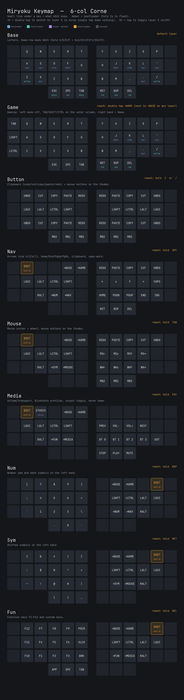

# Corne Custom — Miryoku ZMK

A hand-wired 6-column Corne (42 keys) running a faithful [Miryoku](https://github.com/manna-harbour/miryoku)
layout on [ZMK](https://zmk.dev), QWERTY with home-row mods.

## Keymap



The diagram is generated straight from [`config/corne_custom.keymap`](config/corne_custom.keymap).
Each layer shows what it's for and which key reaches it; the small line under a
key is what **hold** does (blue = modifier, teal = layer). Amber keys enter the
bootloader (hold 2 s).

Two symbols show up inside layers:

- **`→X`** — a double-tap-guarded switch: tap once and nothing happens, tap again
  to switch to layer X. The guard stops a stray single tap from changing layers.
- **`X⇄`** — tap once to toggle layer X on, tap again to toggle it off (used to
  enter/leave the Game layer).

Regenerate after editing the keymap:

```sh
python3 scripts/generate_keymap_layout.py    # needs Pillow; writes keymap-diagram.png
```

## Layers

| # | Layer  | For | Reach (hold from Base) |
|---|--------|-----|------------------------|
| 0 | Base   | Letters, home-row mods GACS | default |
| 1 | Game   | Left mods off, TAB/SHIFT/CTRL on outer column | double-tap `→GAME` (next to `→BASE`) |
| 2 | Button | Clipboard + mouse buttons | hold `Z` or `/` |
| 3 | Nav    | Arrows (vim h/j/k/l), Home/End/PgUp/PgDn | hold `SPC` |
| 4 | Mouse  | Mouse cursor + wheel | hold `TAB` |
| 5 | Media  | Volume/transport, Bluetooth, output toggle | hold `ESC` |
| 6 | Num    | Number pad + math symbols | hold `BSPC` |
| 7 | Sym    | Shifted symbols | hold `RET` |
| 8 | Fun    | F1–F12 + system keys | hold `DEL` |

## Build & flash

Firmware builds in GitHub Actions on every push; the `.uf2` files land in
[`firmware/firmware/`](firmware/firmware/). To flash: double-tap reset (or hold
an amber bootloader key 2 s) to mount the drive, then drag the matching `.uf2`
onto it. Flash **both halves**.
